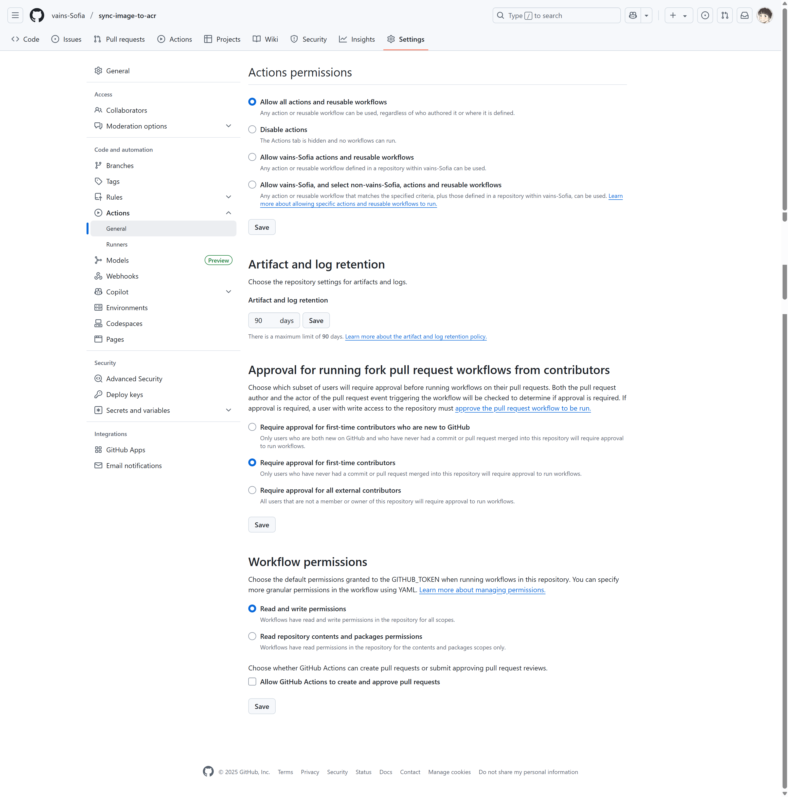

# Docker Hub 镜像同步至阿里云 ACR

[](https://github.com/vains-Sofia/sync-image-to-acr/blob/main/.github/workflows/sync-public.yml)

本项目通过 GitHub Actions 自动将 Docker Hub 上的公共镜像同步到阿里云容器镜像服务 (ACR)，帮助解决国内网络环境下 Docker Hub 访问的问题。

## 🚀 功能特性

- **Issue 触发同步**：通过创建 GitHub Issue 触发镜像同步
- **批量同步**：支持一次同步多个镜像
- **自动评论**：同步过程中自动在 Issue 中评论进度和结果
- **错误处理**：自动处理无法拉取的镜像（私有或不存在）
- **自动关闭**：同步完成后自动关闭 Issue

## 💡推荐在使用前先在issues中查看是否有需要同步的镜像

## 📋 使用方法

### 1. 创建同步 Issue

在 GitHub 仓库中创建一个新的 Issue，标题必须以 `sync:` 开头，后面跟要同步的镜像名称。

#### 同步单个镜像
标题：
```
sync: nginx:latest
```

#### 同步多个镜像
标题：
```
sync: nginx:latest alpine:3.18 redis:7-alpine
```

#### 使用默认镜像列表
标题：
```
sync:
```
（留空时将使用预设的默认镜像列表）

### 2. 等待同步完成

创建 Issue 后，GitHub Actions 会自动开始同步过程：

1. **开始通知**：机器人会评论同步开始的消息
2. **同步过程**：逐个拉取、标记和推送镜像到 ACR
3. **结果反馈**：提供可用的 ACR 拉取命令
4. **自动关闭**：同步完成后自动关闭 Issue

### 3. 使用同步后的镜像

同步完成后，可以使用以下格式从 ACR 拉取镜像：

📦 以下为可用于拉取的 ACR 镜像命令：

```bash
# docker pull registry.cn-guangzhou.aliyuncs.com/github-proxy/镜像名:标签
docker pull registry.cn-guangzhou.aliyuncs.com/github-proxy/redis
```

## ⚙️ 配置说明

### 必需的 Secrets

在 GitHub 仓库的 Settings > Secrets and variables > Actions 中添加以下 secrets：

| Secret 名称 | 描述 | 示例 |
|------------|------|------|
| `ACR_REGISTRY` | 阿里云 ACR 注册表地址 | registry.{region}.aliyuncs.com` |
| `ACR_USERNAME` | ACR 用户名 | `your-username` |
| `ACR_PASSWORD` | ACR 密码 | `your-password` |
| `DEFAULT_IMAGES` | 默认同步的镜像列表（可选） | `nginx:latest alpine:3.18 redis:7-alpine` |

### 获取 ACR 凭据

1. 登录[阿里云容器镜像服务控制台](https://cr.console.aliyun.com/)
2. 创建命名空间（如 `github-proxy`）
3. 在"访问凭证"页面获取用户名和密码
4. 注册表地址格式：`{your-registry}.{region}.aliyuncs.com`

## 🔧 工作流程详解

1. **触发条件**：Issue 创建或编辑，且标题以 `sync:` 开头
2. **权限设置**：需要 `issues: write` 和 `contents: read` 权限
3. **镜像提取**：从 Issue 标题中提取镜像列表
4. **预评论**：在 Issue 中评论即将同步的镜像列表
5. **ACR 登录**：使用配置的凭据登录阿里云 ACR
6. **镜像同步**：
    - 从 Docker Hub 拉取镜像
    - 重新标记为 ACR 格式
    - 推送到 ACR 仓库
7. **结果反馈**：在 Issue 中提供拉取命令
8. **自动关闭**：同步完成后关闭 Issue



## 📝 Issue 示例

### 同步常用镜像
```
标题：sync: nginx:latest node:18-alpine python:3.11-slim
内容：同步一些常用的基础镜像
```

### 同步特定版本
```
标题：sync: postgres:15.4 redis:7.2-alpine mysql:8.0
内容：同步数据库相关镜像
```

## ⚠️ 注意事项

- 只能同步 Docker Hub 上的**公共镜像**
- 私有镜像或不存在的镜像会被跳过，并在评论中标记
- 镜像名称格式：`repository:tag`（如 `nginx:latest`）
- 同步后的镜像存储在 ACR 的 `github-proxy` 命名空间下
- 每次同步会覆盖之前的同名镜像

## 🤝 贡献

欢迎提交 Issue 和 Pull Request 来改进这个项目！

## 📄 许可证

本项目采用 MIT 许可证 - 查看 [LICENSE](./LICENSE) 文件了解详情。

## 🔗 相关链接

- [阿里云容器镜像服务](https://help.aliyun.com/product/60716.html)
- [GitHub Actions 文档](https://docs.github.com/en/actions)
- [Docker 官方文档](https://docs.docker.com/)